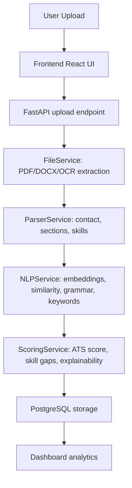

# Architecture Overview

## System architecture

The AI Resume Analyzer follows a modern full-stack architecture:

- **Frontend**: React + Vite + TailwindCSS. Provides upload UI, dashboard analytics, score meters, and recruiter views.
- **Backend**: FastAPI. Accepts uploads, extracts resume text, parses entities, computes embeddings, and generates ATS/semantic scores.
- **Database**: PostgreSQL. Stores resume metadata, job descriptions, and analysis reports for recruiter dashboards.
- **NLP Pipeline**: spaCy for NER, SentenceTransformers for embeddings, scikit-learn for keyword ranking, OCR for scanned resumes.

## Component flow

